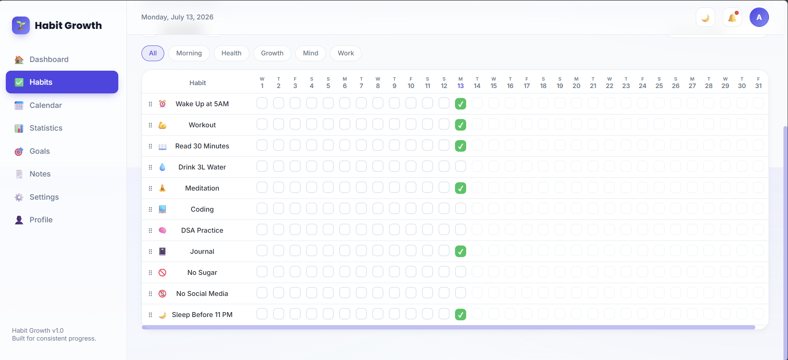

# 🌱 Habit Growth

**Habit Growth** is a premium, Notion-meets-Apple-inspired habit tracking dashboard — built with **pure HTML, CSS, and vanilla JavaScript**. No frameworks, no build step. Clone it, open it, and it just works.


---

## ✨ Features

- **Dashboard** — daily greeting, live progress ring, week/month completion, current & longest streaks, today's habit checklist, rotating motivational quote, goal previews
- **Habit Tracker** — monthly grid view (habits × days), animated checkboxes, drag-and-drop reordering, search + category filters, confetti on a 100% day
- **Calendar** — month view with completion indicators per day, click any date to see what was done and attach a note
- **Statistics** — Chart.js line/bar/doughnut charts, a GitHub-style contribution heatmap, CSV export, print-to-PDF report
- **Goals** — long-term & short-term goals with deadlines, priority, and progress sliders
- **Notes** — pinning, checklists, and full-text search
- **Settings** — light/dark theme, accent color picker, JSON backup & restore, full data reset
- **Profile** — name, photo, and daily/weekly/monthly targets
- **PWA-ready** — installable via `manifest.json`, works offline through a service worker
- **Design** — glassmorphism, soft shadows, gradient backgrounds, smooth micro-animations, fully responsive (desktop → mobile)

All data is stored locally in your browser via `localStorage` — nothing is sent to a server.

---

## 📸 Preview

> 

---

## 🛠️ Tech Stack

| Layer      | Tech                                  |
|------------|----------------------------------------|
| Structure  | Semantic HTML5                         |
| Styling    | Pure CSS3 (CSS variables, no Bootstrap/Tailwind) |
| Logic      | Vanilla JavaScript (ES6+)              |
| Charts     | [Chart.js](https://www.chartjs.org/) (via CDN) |
| Fonts      | Poppins (display) + Inter (body), via Google Fonts |
| Storage    | Browser `localStorage`                 |
| Offline    | Service Worker + Web App Manifest      |

---

## 📁 Folder Structure

```
HabitGrowth/
├── index.html              # single-page app shell — all 8 pages live here
├── manifest.json            # PWA metadata
├── service-worker.js        # offline caching of the app shell
├── css/
│   ├── style.css            # tokens, resets, shell layout, buttons, modals
│   ├── dashboard.css        # dashboard-specific components
│   ├── habit.css            # habit table, calendar, heatmap, goals, notes
│   └── responsive.css       # tablet & mobile breakpoints
├── js/
│   ├── storage.js           # localStorage read/write + default seed data
│   ├── utils.js             # date/streak helpers, toasts, confetti, ripple
│   ├── habit.js             # habit tracker page logic
│   ├── charts.js            # Chart.js setup + contribution heatmap
│   ├── calendar.js          # calendar page logic
│   └── app.js                # navigation, theme, dashboard, goals, notes, settings, profile
└── assets/
    └── icons/                # PWA icons
```

---

## 🚀 Getting Started

No build tools, no `npm install` — this is a static site.

### Option 1 — Just open it
Double-click `index.html` and it will open in your default browser. Everything works except the service worker (which needs a real server, not `file://`).

### Option 2 — Run with a local server (recommended)
This enables the service worker for offline support.

**Using VS Code:**
1. Install the **Live Server** extension.
2. Right-click `index.html` → **Open with Live Server**.

**Using Python:**
```bash
cd HabitGrowth
python3 -m http.server 8080
```
Then open `http://localhost:8080` in your browser.

**Using Node:**
```bash
npx serve HabitGrowth
```

---

## 💾 Data & Privacy

Habit Growth stores everything — habits, goals, notes, calendar notes, profile, and settings — in a single `localStorage` key in your browser. Nothing leaves your device.

- **Backup**: Settings → Backup Data → downloads a `.json` file.
- **Restore**: Settings → Restore Data → upload a previously downloaded backup.
- **Reset**: Settings → Reset Data → wipes everything and reseeds default habits.

---

## ⌨️ Keyboard Shortcuts

| Key | Action                          |
|-----|----------------------------------|
| `/` | Focus the habit search box (on the Habits page) |

---

## 🗺️ Roadmap / Ideas

- [ ] Firebase Authentication (Email + Google login) and Firestore sync across devices
- [ ] Real push notifications for reminders
- [ ] Pomodoro / Focus mode timer
- [ ] XP levels, badges, and weekly/monthly challenges
- [ ] Expense, mood, water, weight, and sleep trackers as dashboard widgets

Contributions and forks that build on these are very welcome.

---


## 📄 License

Released under the [MIT License](LICENSE) — free to use, modify, and distribute.

---

Built with care for people trying to become 1% better every day. 🌱
